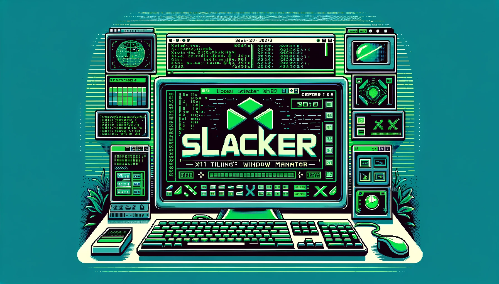

<div align="center">
   <h1>Slacker X11 Environment</h1>
   
   
   
   
   
   

   <br>
   <p>An X11 Tiling Window Manager for GNU/Linux and BSD's.</p>
</div>

## Background

> Slacker Window Manager (swm) is an X11 (The X Window System) non-reparenting window manager.
> Slacker uses Xlib (the original library released by MIT in the mid 1980s) as the library to interact with the X11 protocol,
> rather than the newer XCB library released in the early 2000's. This is mostly because Xlib is better documented, and I find
> it historically pleasing to program against.

## Table of Contents

- [Features](#features)
- [Install](#install)
- [Development](#development)
- [Maintainers](#maintainers)
- [Contributing](#contributing)
- [License](#license)

## Features

- [x] Extremely light weight, < **250 mb** of ram and very fast, minimal dependencies.
- [x] Tiling window management with floating, master/stack and monocal layouts.
- [x] Keyboard driven with mouse support.
- [x] Built in status bar with tags as workspaces.
- [x] Configured through editing the `swm/src/config.c` file. **Swm** relies on being recompiled
      after changes to its code, this works because it recompiles so fast.
- [x] Built in program autostart support (no need to use the .xinitrc) found in `swm/src/main.c`.
- [ ] Multi-monitor support (under development).
- [ ] Runtime configuration file (will replace the config.h approach).
- [ ] System tray support.
- [ ] Window gaps
- [x] Arbitrarily swapping windows with master window in stack.
- [x] Horizontally resizing windows
- [ ] Vertically resizing windows
- [ ] Re-write/re-implement the suckless drawable.h FontConfig code.

## Install

> Installing and using the window manager release build

```bash
# Installs the X11 libraries, dunst, volumeicon-alsa, network-manager, feh, picom,
# for apt-get based systems. (will prompt for sudo)
sudo make init

# Compiles the window manager installs binary, desktop file, picom file, etc.
sudo make install

# Uninstall the window manager and support files
sudo make uninstall
```

### Default Configuration

> See the `swm/src/config.c` file to edit the configuration.

#### The following programs/fonts should be found on your system

1. konsole - the terminal emulator (change to what ever you would like)
2. JetBrains Mono NerdFont - if not found monospace will be used as the fallback
3. dmenu - The program launcher

```c
const uint32_t G_BORDER_PIXEL                   = 2;
const uint32_t G_SNAP_PIXEL                     = 32;
const int32_t G_SHOW_BAR                        = 1;
const int32_t G_TOP_BAR                         = 1;
const char G_USER_FONT[]                        = "JetBrainsMono Nerd Font Mono:size=16";
const char G_DMENU_FONT[]                       = "JetBrainsMono Nerd Font Mono:size=17";
const char G_COLORSCHEME_BACKGROUND[]           = "#131313";
const char G_COLORSCHEME_BORDER[]               = "#393939";
const char G_COLORSCHEME_FOREGROUND[]           = "#dde1e6";
const char G_COLORSCHEME_SECONDARY[]            = "#262626";
const char G_COLORSCHEME_PRIMARY[]              = "#78a9ff";
const float G_MASTER_FACTOR                     = 0.55;
const int32_t G_MASTER_COUNT                    = 1;
const int32_t G_RESIZE_HINTS                    = 1;
const int32_t G_LOCK_FULLSCREEN                 = 1;
char G_DMENU_MONITOR[]                          = "0";
const char *G_DMENU_COMMAND[]                   = {"dmenu_run", "-m", G_DMENU_MONITOR, "-fn", G_DMENU_FONT, "-nb", G_COLORSCHEME_BACKGROUND, "-nf", G_COLORSCHEME_FOREGROUND, "-sb", G_COLORSCHEME_PRIMARY, "-sf", G_COLORSCHEME_SECONDARY, NULL};
const char *G_TERMINAL_COMMAND[]                = {"konsole", NULL};
const char *G_TAGS[]                            = { "", "", "", "", "", "", "", "", "" };
```

## Development

> Slacker uses a Makefile only approach for its build system, no overly complicated CMake, or Meson
> will be found here.
> Install the development tools using the following make commands.

```bash
# Install all X11 libraries and development tools for apt-get, or pacman based systems.
sudo make init-dev

# Run the window manager in an embedded X window for testing and development
make swm-debug

```

> The following utilities are what a Unix C programmer using Makefiles targeting
> the X11 environment will need for debugging and testing, and sanity. They are all
> installed with the above init-dev command.

1. `bear` => Generates a `compile_commands.json` file so your
   language service provider (clangd) will know what the hell is going on.

   - Usage: **bear -- make all**

2. `Xephyr` => Allows the programmer to run the Window Manager in a nested X session
   so you don't have to log out , and back into the actual window manager. Perfect for developing, debugging and testing.

   - Usage: **make swm-debug**

3. `clang-format` => Formats all source code files according the the root .clang-format file.
   This project uses the Linux kernel clang-format.

   - Usage **make format**

4. `clangd` => Modern C/C++ code analyzing to editors.
   - Usage: Vim, Emacs, Vscode and Jetbrains all support it and handle it for you.

### Debugging

This repository includes a [Vscode launch.json](.vscode/launch.json) file for attaching a debugger
to `swm` while it's running inside an embedded Xephyr window. You will need to llvm debugging extension installed.
You will also need to run the following commands.

> This allows the necessary permissions needed for the debugger to attach.

`echo 0 | sudo tee /proc/sys/kernel/yama/ptrace_scope`

> This is the compile command, there is a 15 second pause to give time to attach the debugger to the process,
> while compiled in debug mode, all debugging messages from `swm` will be printed to stdout.

`make swm-debug`

## Maintainers

[@thebashpotato](https://github.com/thebashpotato)

## Contributing

PRs accepted.

Small note: If editing the README, please conform to the [standard-readme](https://github.com/RichardLitt/standard-readme) specification.

## License

MIT © 2023 Matt Williams
